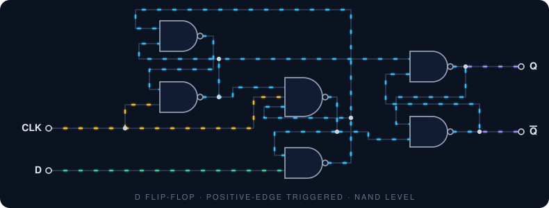

<!-- ============================================================
  PROFILE README  |  repo: EduardoZamoran/EduardoZamoran
  Files needed in the repo:  README.md, README.es.md, assets/*.svg
  Replace every "TODO" before publishing.
============================================================ -->

 

**Embedded Systems &nbsp;·&nbsp; Digital & IC Design &nbsp;·&nbsp; Linux Systems**

  

🇬🇧 English &nbsp;·&nbsp; <a href="./README.es.md">🇲🇽 Español</a>

---

## About

I'm a **4th-semester Electronics and Intelligent Systems Engineering student** at **CUCEI, Universidad de Guadalajara** (expected graduation: **January 2029**), with a technical background in electronics.

My work sits at the boundary between hardware and software: **RTL design and FPGA prototyping**, **embedded firmware** (bare-metal and framework-based), **analog and PCB design**, and **Linux tooling and servers**. I'm currently learning the open-source **IC design flow**, from RTL to GDSII, on real process design kits.

| | |
|---|---|
| 🎓 **Education** | B.Eng. in Electronics and Intelligent Systems, CUCEI – UdeG |
| 🔭 **Currently learning** | Open-source ASIC flow with **LibreLane** on **GF180MCU (180 nm)** and **SKY130 (130 nm)** |
| 🤝 **Open to** | Internships and networking |
| 🏛️ **Community** | Secretary, **IEEE CASS UDG Student Branch Chapter** |

---

## Technical Stack

Working proficiency across the stack: **intermediate**.

| Area | Tools |
|---|---|
| **Languages** |        |
| **Digital Design · FPGA · IC** |          |
| **Embedded Systems** |        |
| **Analog · Simulation · PCB** |     |
| **Systems · Tooling** |      |

---

## Logic in Motion

Positive-edge-triggered D flip-flop built from six NAND gates.

---

## Repository Hub

Work is organized by discipline. Each hub collects the projects, labs and notes for that area.

| | | |
|:---:|:---:|:---:|
|  RTL · Testbenches · Synthesis |  LibreLane · SKY130 · GF180MCU |  Firmware · Drivers · Control |
|  Simulation · Converters · KiCad |  Scripting · Automation · Admin |  Python · MATLAB |

<!-- TODO: once your hub repos exist, replace each link with the real repo,
     e.g. https://github.com/EduardoZamoran/digital-design-fpga -->

---

## Featured Projects

Repositories are being cleaned up and documented. They will appear here as soon as they are ready.

<!-- TODO: when a project is ready, add it here with a short description and a link,
     e.g. [rtl-cla-adders](https://github.com/EduardoZamoran/rtl-cla-adders) -->

---

## IEEE CASS UDG Student Branch Chapter

 

I serve as **Secretary** of the IEEE Circuits and Systems Society student chapter at Universidad de Guadalajara.

- Organize chapter activities and coordinate with members and officers.
- Draft formal letters to IEEE requesting financial support for calls and funding opportunities.
- Manage permits and administrative procedures with the university.
- Help organize technical workshops for students.

<!-- TODO: add concrete numbers when you have them (workshops organized,
     attendees, members, funding obtained). Numbers make this section stand out. -->

---

## Certifications & Courses

<b>View certificates</b>

 

<!-- TODO: replace "#" with each credential URL (Credly, Coursera, Google Drive, etc.)
     and rename each badge, e.g. Certificate_Verilog_HDL -->

---

## Currently Learning

- **Open-source ASIC design flow** with LibreLane: synthesis, floorplanning, place and route, and signoff.
- **Process design kits:** GlobalFoundries **GF180MCU (180 nm)** and SkyWater **SKY130 (130 nm)**.

---

Building efficient hardware and code that stays close to the machine.

